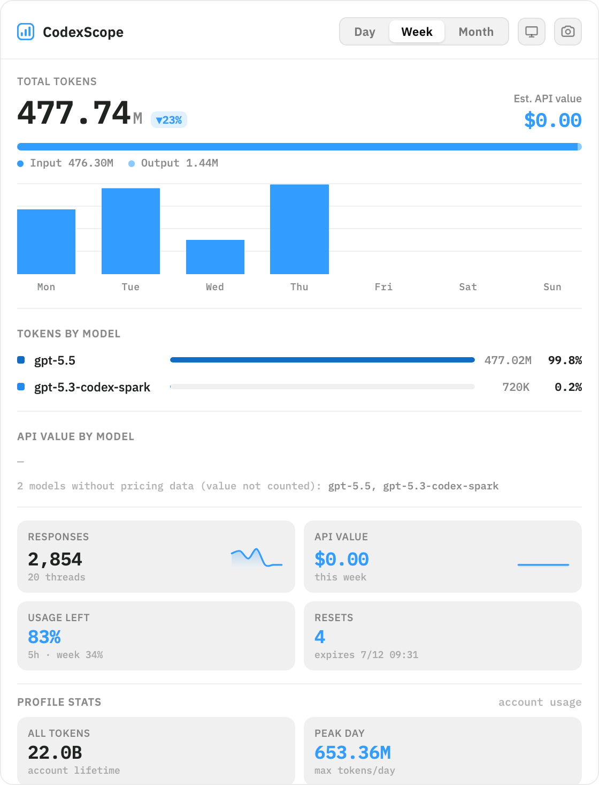

# CodexScope

English · [中文](README-zh.md)



A menu-bar / system-tray app for macOS and Windows that shows local Codex token usage, estimated API value, model mix, tool-call activity, account usage stats, and current rate-limit state.

Stack: Tauri 2 + React + TypeScript (frontend) / Rust (data layer).

CodexScope is adapted from [HduSy/tokenscope](https://github.com/HduSy/tokenscope), which is an MIT-licensed dashboard for Claude CLI usage. This project keeps the original desktop shell and visual structure, then replaces the data layer with Codex-specific log parsing and account/rate-limit integrations.

## What It Does

- Shows today's Codex token count in the menu-bar tooltip / tray label
- Click to open the panel: Day / Week / Month toggle
- Metrics: total tokens, input / cached input / output split, responses, threads, and estimated API value
- Breakdowns: tokens by model, API value by model, and top Codex tool calls
- Account profile stats when `codex app-server` data is available: all-time tokens, peak day, longest thread, streaks, top reasoning effort, thread count, and tool runs
- Rate-limit cards: remaining primary window, weekly window summary, available manual reset credits, and earliest reset-credit expiry when readable
- Daily activity heatmap across the retained history window
- System/dark/light theme switcher
- One-click dashboard screenshot saved to Desktop
- macOS menu-bar popover positioning tuned for notched displays and multi-monitor setups

## Data Sources

| Purpose | Source |
| --- | --- |
| Token usage and tool calls | `~/.codex/sessions/**/rollout-*.jsonl` |
| Archived sessions | `~/.codex/archived_sessions/*.jsonl` |
| Model and reasoning effort | Latest `turn_context` in each rollout JSONL |
| Account usage summary | `codex app-server --stdio`, method `account/usage/read` |
| Rate-limit windows | `codex app-server --stdio`, method `account/rateLimits/read` |
| Manual reset-credit expiry | ChatGPT reset-credit endpoint using local Codex auth, when available |
| Model prices | OpenAI-published API prices for OpenAI/Codex models, then `models.dev`, LiteLLM, and the bundled snapshot |
| Local cache | `~/Library/Caches/codexscope/` on macOS |

CodexScope is read-only with respect to Codex session logs. It reads local JSONL files and Codex account metadata; it does not edit Codex configuration or session history.

## Key Processing

- Incremental ingest reads only appended bytes after the first scan and stores compact events in the app cache
- The parser tracks `session_meta` and `turn_context` so appended token events keep the correct session, model, and reasoning effort
- If an incremental read starts in the middle of a file, CodexScope seeds parser state by scanning the already-read prefix for the latest `turn_context`
- `codex` fallback labels are treated as unknown product-surface labels, not as model names
- Tool calls are extracted from `response_item` events such as `function_call`, `web_search_call`, `tool_search_call`, and other `*_call` records
- Day / Week / Month reports are calendar-based and compare against the previous matching period for token and value deltas
- Account usage from the Codex app server is preferred for all-time profile and daily heatmap totals when available; retained local logs are the fallback
- Rate-limit data is cached separately so the dashboard can still display the last known state if a refresh fails

> API value is an estimate based on OpenAI's published API prices for known OpenAI/Codex models, with public third-party price tables used only as fallbacks. ChatGPT/Codex subscription billing and quota behavior may differ.

## Token Types & Cost Formula

Codex `token_count` events expose:

| Stage | Codex field | Display |
| --- | --- | --- |
| Input | `input_tokens - cached_input_tokens` | Input |
| Cache read | `cached_input_tokens` | Cached input |
| Output | `output_tokens` | Output |
| Reasoning output | `reasoning_output_tokens` | Informational; not added separately |

Tokens shown in the UI:

```text
total = input + cached_input + output
```

Estimated API value is calculated with the best matching price entry. For OpenAI/Codex models with published OpenAI API pricing, CodexScope uses the standard-processing, short-context API price as the first priority:

```text
value = input        * price.input
      + cache_read   * price.cache_read
      + output       * price.output
```

Codex logs do not currently expose a separate cache-write bucket in the events this app consumes, so cache creation is kept at zero unless future logs provide it. Long-context, Batch, Flex, Priority, data-residency, and ChatGPT subscription billing may differ from this estimate.

## Install

There is no packaged public release yet. For now, build locally from source.

### macOS

```bash
pnpm install
pnpm tauri build
open src-tauri/target/release/bundle/macos/CodexScope.app
```

If macOS blocks the unsigned build, run:

```bash
xattr -cr src-tauri/target/release/bundle/macos/CodexScope.app
open src-tauri/target/release/bundle/macos/CodexScope.app
```

### Windows

```bash
pnpm install
pnpm tauri build
```

The NSIS installer is written under `src-tauri/target/release/bundle/nsis/`.

## Develop

```bash
pnpm install
pnpm tauri dev
```

Frontend-only preview, using a real-data snapshot:

```bash
cd src-tauri
cargo run --example dump > ../public/dev-dashboard.json
cd ..
pnpm dev
```

## Build

```bash
pnpm build
pnpm tauri build
```

Release artifacts are written under `src-tauri/target/release/bundle/`.

## Structure

```text
src/                       React frontend
  data.ts                  types + Tauri bridge + theme + formatting
  charts.tsx               chart primitives
  App.tsx                  main panel
src-tauri/src/
  store.rs                 incremental Codex rollout JSONL ingest
  parser.rs                Day / Week / Month aggregation + profile stats
  account_usage.rs         Codex app-server and reset-credit refresh
  pricing.rs               OpenAI API price overrides + models.dev / LiteLLM fallback costing
  model.rs                 data structures returned to the frontend
  lib.rs                   Tauri commands + menu-bar tray / popover behavior
```

## Attribution & License

CodexScope is based on [HduSy/tokenscope](https://github.com/HduSy/tokenscope). The original project is licensed under the MIT License, and its copyright notice is preserved in [LICENSE](LICENSE).

This adaptation changes the product target from Claude CLI usage to Codex usage, adds Codex account/rate-limit integrations, updates the UI labels and icons, and keeps the source available under the same MIT terms. See [NOTICE](NOTICE) for the attribution note.

## Community

- Contributions: [CONTRIBUTING.md](CONTRIBUTING.md)
- Security reports: [SECURITY.md](SECURITY.md)
- Code of conduct: [CODE_OF_CONDUCT.md](CODE_OF_CONDUCT.md)
